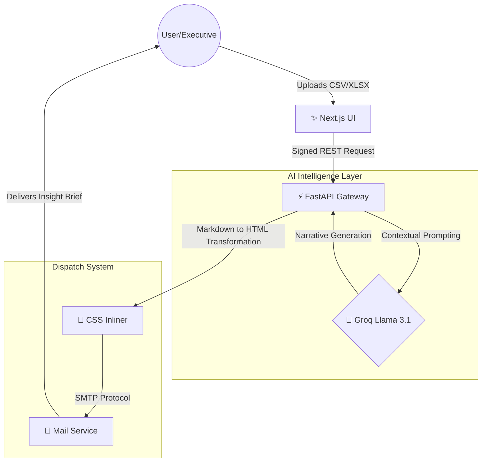
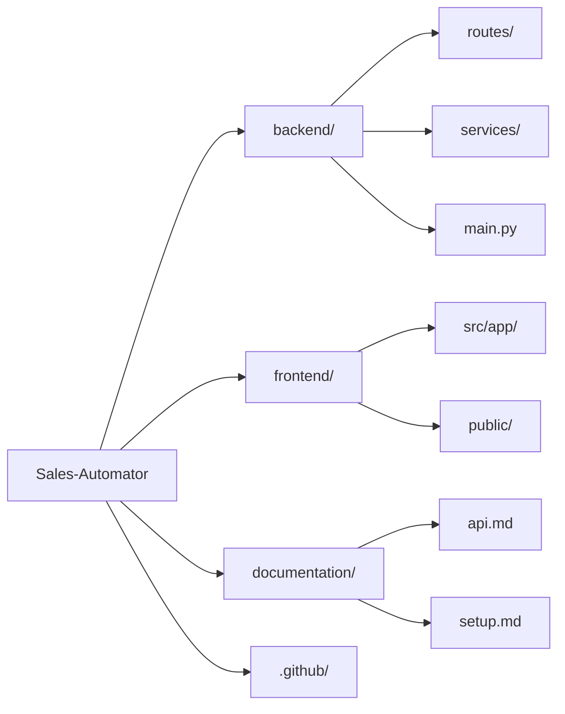

# 📈 Sales Insight Automator


🌐 **Live App**: [ai-sales-in.vercel.app](https://ai-sales-in.vercel.app) | 📡 **API Docs**: [/docs](https://anuj-er-sales-insight.hf.space/docs)

**A containerized, AI-powered ecosystem designed to transform raw quartersly sales data into actionable executive narratives via zero-latency LLM inference.**

---

## 🎯 Executive Summary

The **Sales Insight Automator** is a production-grade platform engineered to solve the "data overwhelm" challenge in high-velocity sales environments. By leveraging state-of-the-art Generative AI (Groq Llama 3.1), it ingests massive datasets and distills them into beautifully styled, professional HTML reports delivered instantly to stakeholder inboxes.

### Why This Project Exists
This system was developed to showcase the integration of **AI-Cloud DevOps** principles. It emphasizes security, infrastructure-as-code (Docker), and automated delivery pipelines (CI/CD), providing a robust foundation for enterprise-level data intelligence tools.

---

## 🏛 System Architecture

The application follows a decoupled, asynchronous micro-architecture designed for scalability and performance.

### Logic Flow & Integration


### Repository Structure


---

## 🛠 Features & Capabilities

- **🚀 High-Performance Parsing**: Asynchronous handling of multi-megabyte sales datasets using FastAPI.
- **🧠 Intelligent Narratives**: Context-aware summaries that identify trends, anomalies, and performance metrics using Llama 3.1.
- **📧 Automated Professional Reporting**: Clean, branded HTML email dispatch using SMTP integration.
- **🔒 Enterprise Security**: 
  - **X-API-Key Protection**: Strict authentication for all inference endpoints.
  - **CORS Hardening**: Granular origin control for production environments.
  - **Environment Isolation**: Zero hardcoded secrets; strictly `dotenv` driven.
- **🐳 Container First**: Optimized Multi-stage Docker builds for minimal footprint.

---

## 🌐 Production Deployment Guide

### Phase 1: Backend (Hugging Face Space)
1. **Space Setup**: Create a new **Docker** Space on [Hugging Face](https://huggingface.co/spaces) and link your GitHub repo or upload the `backend/` directory.
2. **Runtime**: The Space uses the provided `backend/Dockerfile` automatically.
3. **Environment Variables** (set in Space Settings → Repository Secrets):
   - `GROQ_API_KEY`: Your Groq token.
   - `API_KEY`: Your custom `X-API-Key` secret.
   - `ALLOWED_ORIGINS`: Your Vercel URL, e.g. `https://ai-sales-in.vercel.app`.
   - `RESEND_API_KEY`: API key from [resend.com](https://resend.com) — used for email delivery.
   - `SENDER_EMAIL`: A verified sender address on your Resend domain (e.g. `noreply@yourdomain.com`).

> 💡 **Why Resend instead of SMTP?** Most cloud hosts (including Hugging Face Spaces) block outbound SMTP ports (465/587), causing silent email failures. The backend already uses the **Resend HTTP API** (`POST https://api.resend.com/emails`) so no code changes are needed — just supply the two secrets above. Sign up free at [resend.com](https://resend.com), verify a custom domain via DNS, and generate an API key.

4. **Live Backend**: [anuj-er-sales-insight.hf.space](https://anuj-er-sales-insight.hf.space)

### Phase 2: Frontend (Vercel)
1. **Import Project**: Select the `frontend` directory in the Vercel dashboard.
2. **Environment Variables**:
   - `NEXT_PUBLIC_API_URL`: Your Hugging Face Space URL (`https://anuj-er-sales-insight.hf.space`).
   - `NEXT_PUBLIC_API_KEY`: Must match the `API_KEY` set on the backend.
3. **Deploy**: Vercel will automatically detect the Next.js framework and handle the build.
4. **Live Frontend**: [ai-sales-in.vercel.app](https://ai-sales-in.vercel.app)

---

## 🧪 Local Orchestration

For rapid local testing and development:

```bash
# Clone the repository
git clone https://github.com/Anuj-er/AI-Sales-Insight.git
cd AI-Sales-Insight

# Configure local env
cp .env.example .env

# Spin up the entire stack
docker-compose up --build
```

Access the UI at `http://localhost:3000` and the API documentation at `http://localhost:8000/docs`.

---

## 📜 License & Compliance
This project is licensed under the **MIT License**. See the [LICENSE](LICENSE) file for details.

Developed with ❤️ for **Rabbitt AI**.